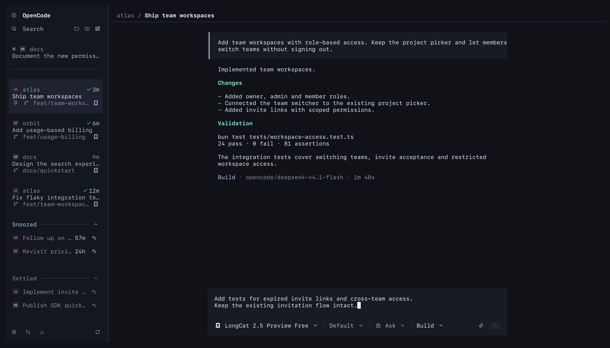

# T3 terminal interface for OpenCode

The plugin adds a T3-style sidebar and composer to OpenCode v2. The host still owns the textarea, model and variant menus, settings, completion, submission and interruption. Colors follow dark Poimandres; surfaces stay square.

The composer toolbar always shows the current agent, including Build or Plan. Click it to open the native agent picker in new drafts, existing threads or the collapsed composer.

## Screenshots

Captured in Ghostty with OpenCode 2.0.20 running the plugin. Session names and conversation content are fixtures in an isolated database. The composer, slash completion and model picker are the actual OpenCode interface.



<details>
<summary>Native model picker and slash commands</summary>


</details>

## Install

Requires OpenCode 2.0.20 or later, Bun, and a terminal with Kitty graphics support. Graphics have been verified in cmux on macOS. Project initials currently require the macOS Arial Bold font.

OpenCode supports installing directly from GitHub:

```sh
opencode plugin add github:Mergemat/opencode-t3-terminal
```

For a local checkout:

```sh
git clone https://github.com/Mergemat/opencode-t3-terminal.git
cd opencode-t3-terminal
bun install --frozen-lockfile
bun run build
```

Add the absolute checkout path to your OpenCode `cli.json`, normally `~/.config/opencode/cli.json`. For the GitHub installation, use `github:Mergemat/opencode-t3-terminal` instead of the local path:

```json
{
  "plugins": ["/absolute/path/to/opencode-t3-terminal"],
  "tabs": { "mode": "off" },
  "session": { "sidebar": "hide" }
}
```

Restart OpenCode. This CLI-only package exposes `tui.js` for local directory discovery and the `./tui` package export. Both load the compiled implementation in `dist/tui.js`, which uses OpenCode's shared OpenTUI and Solid runtime. The GitHub repository includes the compiled entry for direct installation.

See the official [plugin installation docs](https://opencode.ai/v2/docs/plugins), [CLI configuration docs](https://opencode.ai/v2/docs/cli/plugins), and [publishing guide](https://opencode.ai/v2/docs/build/plugins/cli#publish-and-load).

## Development

```sh
bun install --frozen-lockfile
bun run typecheck
bun run test
bun run build
```

The package includes `dist/` and `assets/`. Rebuild after editing source. Local experiments and QA recordings under `work/` are excluded from version control. Third-party asset licenses are kept under `assets/`.

Icons use Lucide assets and provider marks from the T3 source. Regenerate the PNG masks with `bun scripts/generate-icons.ts`. Their licenses are included under `assets/`.

The sidebar keeps active threads in creation/re-entry order. Settle advances to the following card; Snooze hides a thread without stopping its agent. Snoozed work returns at its chosen time, on completion/failure, or when it needs approval/input. Both actions offer five seconds to Undo. Opening snoozed work does not wake it.

`Ctrl+N` chooses a project; `Ctrl+Shift+N` starts in the current project. A fresh draft appears at the top of the sidebar only after text is entered and you navigate away, with a divider below the drafts. Reopening a draft keeps its sidebar preview unchanged while you edit; leaving updates the preview or removes an empty draft. Only empty drafts are reused. Project selection changes the native draft directory; the folder filter only changes the sidebar. Add Project accepts local folders, Git URLs and repositories listed by authenticated `gh` / `glab` accounts.

The PR icon and `/prs` expose GitHub pull requests or GitLab merge requests for the current origin: open, link to a thread, prepare a local checkout or a separate worktree, and create a request from a committed branch. Push/create requires confirmation in the menu. Self-hosted GitLab origins can be configured there. Native workspace, model, permission, agent, settings and statistics menus remain available.

Native attachments are not exposed as serializable drafts by the host plugin API. A draft containing attachments stays with the native editor and cannot be replaced by another draft until its attachments are sent or removed.

Provider checks use disposable repositories and fixture CLIs; they do not push or create remote requests.

Graphics are verified in cmux on macOS and require Kitty graphics support. The renderer writes ordinary placements through OpenTUI's output queue, replacing image identifiers after each frame because cmux caches reused identifiers. Resized, tinted and compressed pixels are cached. Project initials use macOS's Arial Bold font through resvg with system font scanning disabled.

`scripts/inspect-terminal.ts` turns ANSI recordings into text and HTML for layout inspection; graphics must also be checked in a native terminal screenshot.
