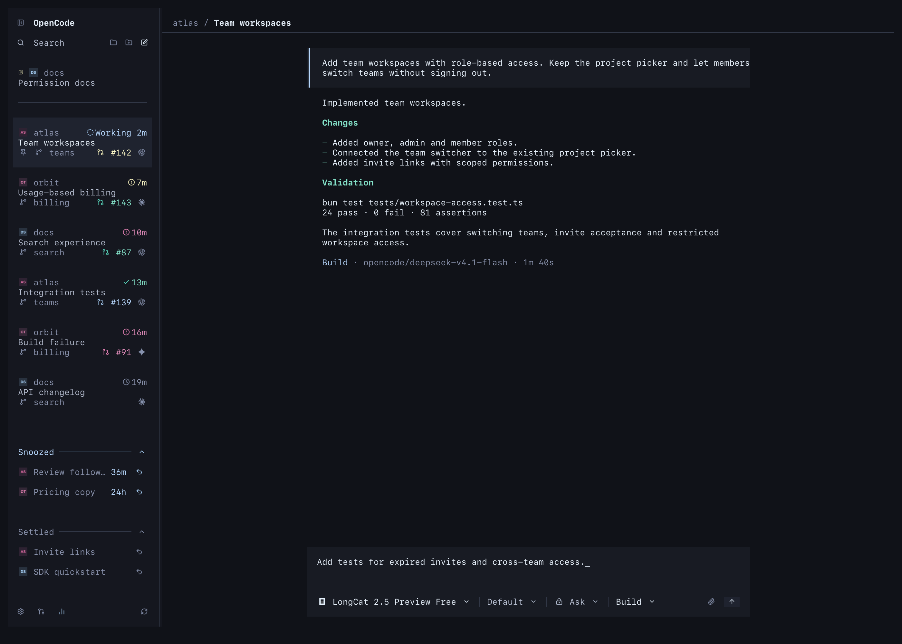
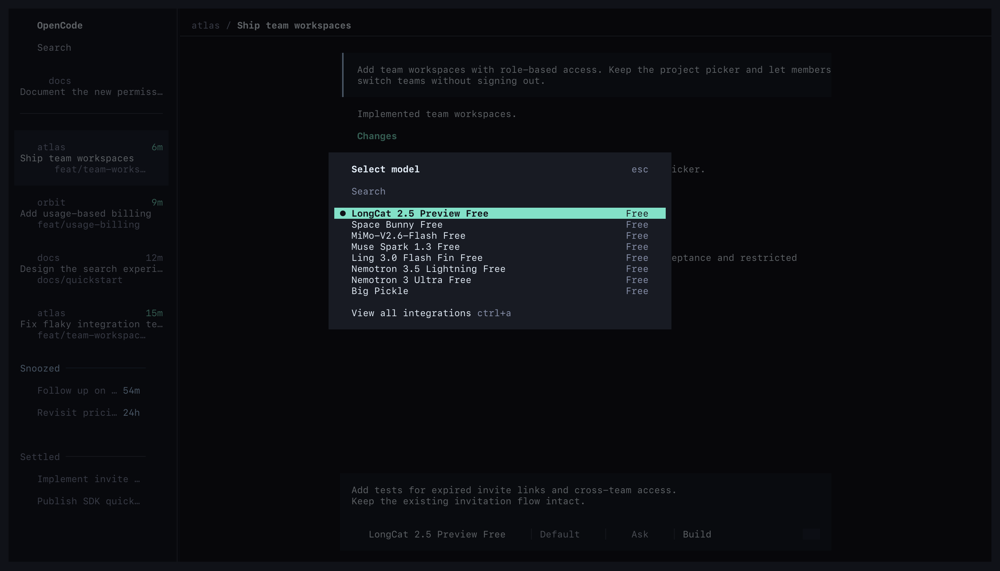
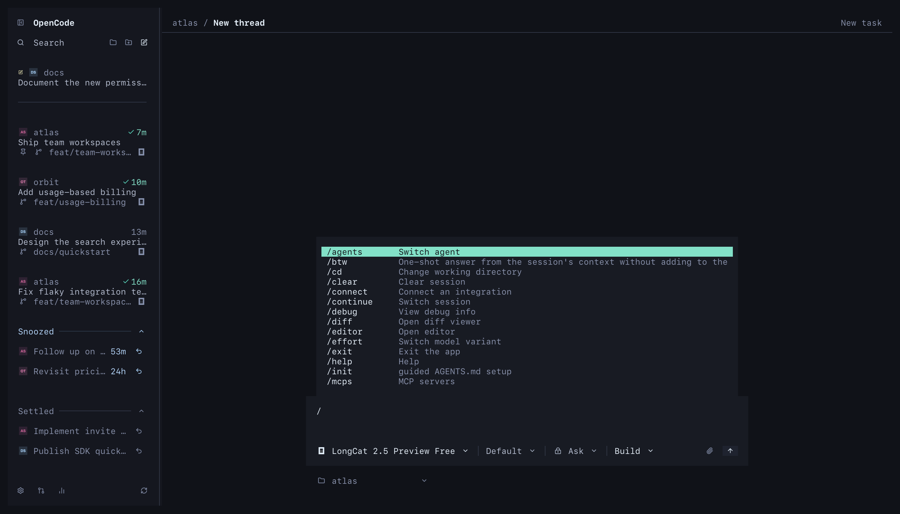

# T3 terminal for OpenCode

A T3-style sidebar and composer for OpenCode v2. Manage threads across projects, pin, snooze or settle them, and link GitHub PRs or GitLab MRs. OpenCode handles editing, attachments and the model, permission and agent menus.



Captured in Ghostty. Thread states, request numbers and conversation content are QA fixtures. The sidebar uses the plugin's components; the composer is native OpenCode.

<details>
<summary>Model picker and slash commands</summary>





</details>

## Install

Requires OpenCode 2.0.20+, Bun and a terminal with Kitty graphics support. Colors follow your OpenCode theme.

```sh
opencode plugin add github:Mergemat/opencode-t3-terminal
```

Disable OpenCode's tabs and sidebar in `~/.config/opencode/cli.json`, then restart:

```json
{
  "tabs": { "mode": "off" },
  "session": { "sidebar": "hide" }
}
```

For a local checkout, run `bun install --frozen-lockfile` and `bun run bundle`, then add its absolute path to the `plugins` array in `cli.json`.

## Use

| Shortcut | Action |
| --- | --- |
| `Ctrl+B` | Toggle sidebar |
| `Ctrl+K` | Find thread |
| `Ctrl+N` | New thread, choose project |
| `Ctrl+Shift+N` | New thread in current project |
| `Ctrl+Shift+S` | Settle or un-settle thread |
| `Ctrl+Shift+Z` | Undo thread action |
| `/prs` | Browse, link or create PRs and MRs |

Snooze hides a thread while its agent keeps running. It returns when the timer expires, work finishes or it needs a response. Settle moves finished work out of the active list. Settling, snoozing and unpinning offer five seconds to undo. Right-click a thread for more actions, including Mark unread and Delete.

Cards show **Done** only for work you have not seen yet; once you open the thread, it shows its age. Each card keeps the branch its thread worked on.

Text drafts persist across projects. Drafts with attachments stay in the native editor until you send or remove the attachments.

## Development

```sh
bun install --frozen-lockfile
bun run typecheck
bun run test
bun run bundle
```

Rebuild after source changes. The repository includes the compiled plugin for GitHub installation. To preview the sidebar and picker with fixture threads, run `bun --preload @opentui/solid/preload --conditions=browser scripts/preview.tsx /tmp/t3-preview`. Asset licenses are in `assets/`; regenerate icons with `bun run generate:icons`.

[OpenCode plugin docs](https://opencode.ai/v2/docs/plugins)
